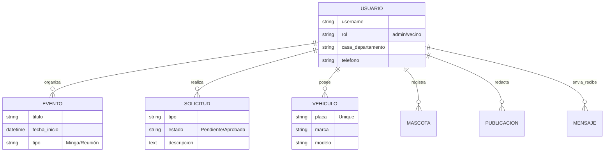

# 📘 Documentación Técnica del Sistema Web "Selva Alegre"

> **Proyecto de Titulación**  
> **Estado:** 🚧 En desarrollo  
> **Versión:** 1.0.0

---

## 1. 🎯 Introducción
El presente documento detalla la arquitectura, diseño y funcionalidad del sistema web desarrollado para el conjunto residencial "Selva Alegre".  
**Objetivo Principal:** Optimizar la comunicación, transparencia y gestión operativa entre la administración y los residentes mediante una plataforma centralizada.

---

## 2. 🛠️ Pila Tecnológica (Tech Stack)

### Backend
  

### Frontend
  

### Herramientas
 

---

## 3. 🏗️ Arquitectura del Sistema

El proyecto implementa el patrón de diseño **MVT (Modelo-Vista-Template)**, separando la lógica de datos, la lógica de control y la interfaz de usuario.

```mermaid
graph TD
    User((Usuario)) --> |Petición HTTP| URL[Dispatcher de URLs]
    URL --> View[Vista (Lógica de Negocio)]
    View --> |Consulta/Guarda| Model[Modelo (Datos)]
    Model --> |SQL| DB[(Base de Datos SQLite)]
    DB --> |Resultados| Model
    Model --> |Objetos Python| View
    View --> |Contexto| Template[Template (HTML)]
    Template --> |Respuesta HTML| User
    
    subgraph "Backend (Django)"
    URL
    View
    Model
    end
    
    subgraph "Frontend"
    Template
    end
```

### Estructura de Directorios Clave
| Directorio | Descripción |
| :--- | :--- |
| `config/` | Configuración global (`settings.py`, `urls.py`). |
| `usuarios/` | **Core del negocio**: Modelos, Vistas, Forms y Admin. |
| `templates/` | Archivos HTML renderizados por Django. |
| `static/` | Assets estáticos (CSS, JS, Imágenes del sistema). |
| `media/` | Archivos subidos por usuarios (Avatares, PDFs). |

---

## 4. 🗄️ Diseño de Base de Datos (Modelos)

Diagrama Entidad-Relación (ERD) simplificado del sistema:



### Diccionario de Datos Resumido

#### 👤 Usuario (Custom User)
Extiende de `AbstractUser`.
- **Roles:** `Admin` (Gestión total) vs `Vecino` (Lectura/Solicitudes).
- **Clave:** Autenticación y gestión de perfiles residenciales.

#### 📅 Evento
- **Propósito:** Calendario comunitario.
- **Tipos:** Mingas, Reuniones, Eventos Sociales.
- **Visual:** Asignación de colores hexadecimales.

#### 📝 Solicitud
- **Flujo:** `Creada` ➝ `Pendiente` ➝ `Revisión Admin` ➝ `Aprobada/Rechazada`.
- **Uso:** Reportes de mantenimiento, quejas o permisos.

#### 🚗 Vehículo
- **Seguridad:** Control de acceso vehicular.
- **Restricción:** Placas únicas en el sistema.

#### 📢 Publicación
- **Comunicación Oficial:** Noticias, Novedades y Finanzas.
- **Multimedia:** Soporte para adjuntar imágenes y PDFs.

---

## 5. 🧩 Módulos y Funcionalidad

### 5.1. Seguridad
- **Decoradores:** `@login_required` para protección global y `@user_passes_test` para zonas de administración.
- **CSRF:** Protección contra falsificación de solicitudes en todos los formularios.

### 5.2. Dashboard Inteligente
| Rol | Funcionalidad |
| :--- | :--- |
| **Administrador** | KPI globales, gestión de solicitudes pendientes, CRUD de usuarios. |
| **Residente** | Calendario personal, estado de mis solicitudes, noticias recientes. |

### 5.3. Gestión Comunitaria
- **Mascotas:** Censo con galería de fotos. 🐾
- **Vehículos:** Registro para control de garita. 🚗
- **Mensajería:** Comunicación interna (futura expansión a chat en tiempo real). 💬

---

## 6. 📝 Bitácora de Implementación

### Hito: Recuperación de Integridad de Datos
Durante el desarrollo, se presentó una inconsistencia crítica debido a un conflicto de migraciones (`0010_merge`).

**Problema:**
- Pérdida del modelo `Publicacion` en código.
- Inexistencia de la tabla `usuarios_vehiculo` en la BD.

**Solución Implementada:**
1.  **Refactorización:** Reescritura del modelo `Publicacion` en `models.py`.
2.  **Merge de Migraciones:** Resolución de conflictos en el historial de migraciones de Django.
3.  **Hotfix de Base de Datos:** Script SQL directo para restaurar la tabla `vehiculo` sin pérdida de datos existentes.

---

## 7. 🚀 Roadmap (Trabajo Futuro)

- [ ] **Notificaciones Push:** Alertas por correo/celular ante nuevas publicaciones.
- [ ] **Reservas:** Sistema de agendamiento para la casa comunal/BBQ.
- [ ] **Pagos:** Integración de pasarela para pago de alícuotas en línea.
